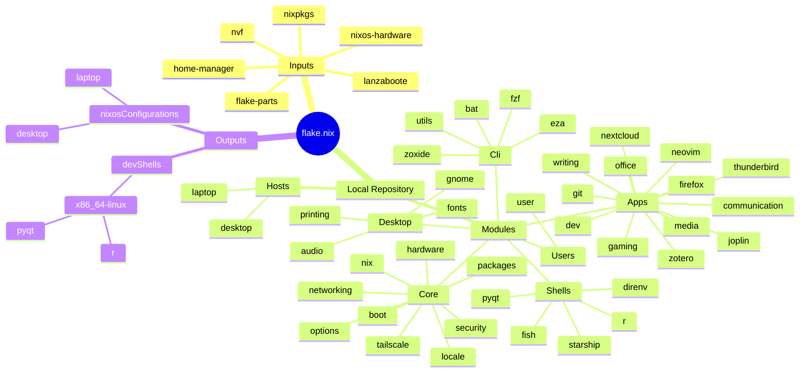

# NixOS Configuration

A modular and declarative NixOS setup managed via Flakes. It heavily utilizes `flake-parts` to organize system configurations and reusable modules across different hosts.

## Architecture Map

The mindmap below visualizes the entire flake architecture. It is **auto-generated** on push by a GitHub Action that parses the Nix schema (`nix flake show` & `metadata`) and scans the local repository structure to map inputs, local modules, and final outputs.

## Flake Map

<!-- FLAKE_MAP_START -->

<!-- FLAKE_MAP_END -->
